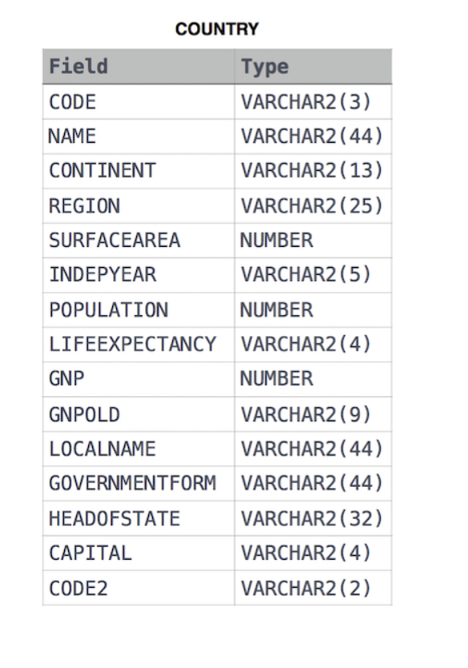
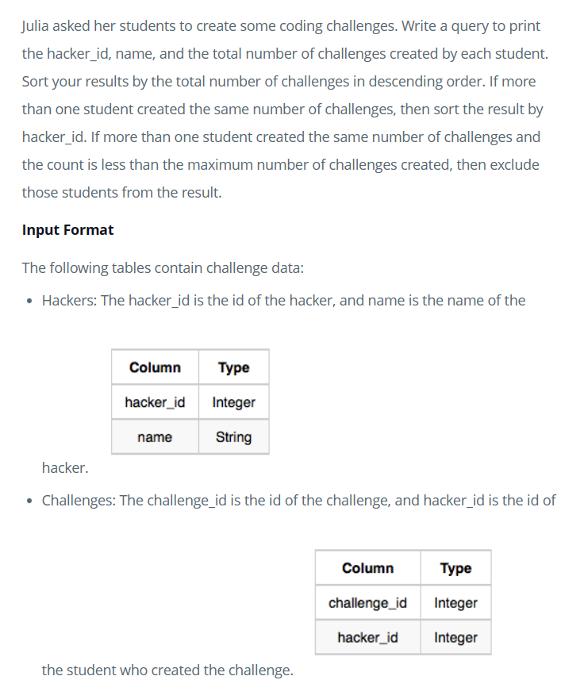
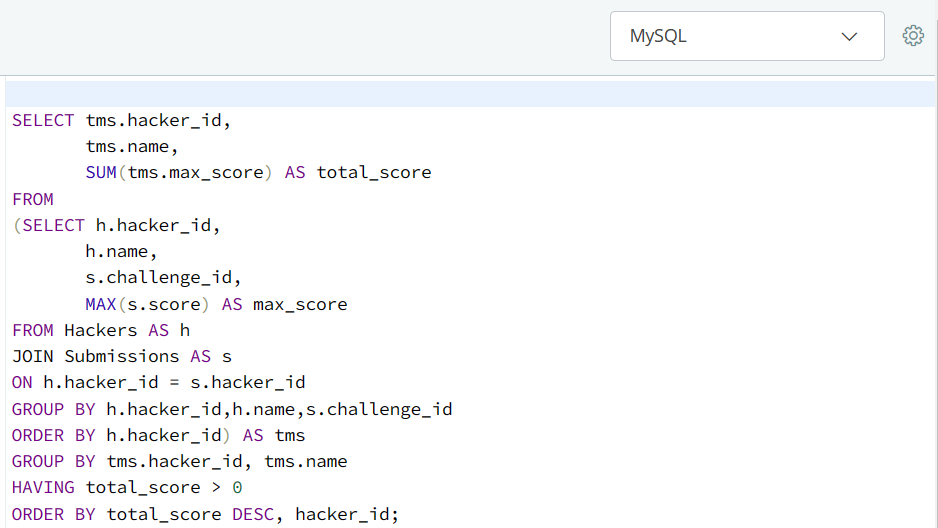

# HackerRank_SQL_Basic_Joins

## Purpose

This repository contains the solutions of HackerRank SQL queries on Basic Joins.

## Source 

- HackerRank

## Basic Join Problems & Solutions

### Problem 1:

### Solution:

### Problem 2:

### Solution:

### Problem 3:

### Solution:

### Problem 4:

### Solution:

### Problem 5:

### Solution:

### Problem 6:

### Solution 1:

#### OR SOLUTION 2:

### Problem 7:

### Solution:

### Problem 8:

### Solution:

